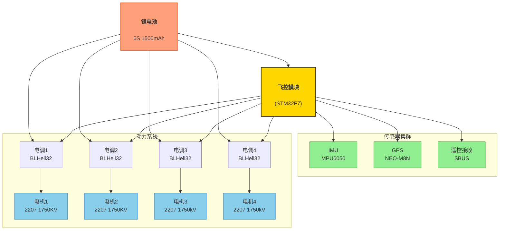

# 飞行器硬件设计

## 飞行器硬件拓扑

飞行器硬件拓扑设计如下:

```mermaid
graph TB
    %% 核心模块
    FC["<div style='padding:10px; border-radius:8px'>
        <b>飞控模块</b><br>
        (STM32F7)
        </div>"]:::fc

    %% 传感器组
    subgraph 传感器集群
        %% direction LR
        IMU["<div style='width:80px'>IMU<br>MPU6050</div>"]:::sensor
        GPS["<div style='width:80px'>GPS<br>NEO-M8N</div>"]:::sensor
        RX["<div style='width:80px'>遥控接收<br>SBUS</div>"]:::sensor
    end

    %% 动力系统
    subgraph 动力系统
        %% direction TB
        ESC1["电调1<br>BLHeli32"] --> M1["电机1<br>2207 1750KV"]:::motor
        ESC2["电调2<br>BLHeli32"] --> M2["电机2<br>2207 1750KV"]:::motor
        ESC3["电调3<br>BLHeli32"] --> M3["电机3<br>2207 1750kV"]:::motor
        ESC4["电调4<br>BLHeli32"] --> M4["电机4<br>2207 1750kV"]:::motor
    end

    %% 电源系统
    Battery["<div style='padding:8px; border-radius:6px'>
        <b>锂电池</b><br>
        6S 1500mAh
        </div>"]:::battery

    %% 连接关系
    FC --> IMU
    FC --> GPS
    FC --> RX
    FC --> ESC1
    FC --> ESC2
    FC --> ESC3
    FC --> ESC4
    Battery --> ESC1
    Battery --> ESC2
    Battery --> ESC3
    Battery --> ESC4
    Battery --> FC

    %% 样式定义
    classDef fc fill:#ffd700,stroke:#333,stroke-width:2px
    classDef sensor fill:#90EE90,stroke:#228B22
    classDef motor fill:#87CEEB,stroke:#1E90FF
    classDef battery fill:#FFA07A,stroke:#FF4500

```

